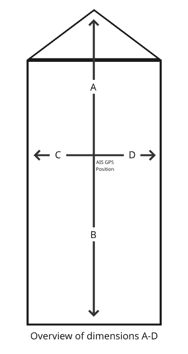

# Barentswatch AIS API Setup for Prometheus 1.5

The Barentswatch AIS provides information on nearly all ships operating in Norwegian waters.
This repository contains a ROS2 node that uses Barentswatch's API to directly fetch this data and transfer it via a ROS publisher. The streamed data can be filtered by a specific area.

The script requires token authentication from Barentswatch to retrieve data. The file `get_token.sh` allows you to obtain a token from the server using your credentials.

## Prerequisites

- ROS2
- jq (lightweight JSON parser):
  ```
  sudo apt install jq
  ```
- Pyhton dependencies: requests & rclpy
  ```
  pip install requests rclpy
  ```

## Setup

1. Clone the repository
2. Create a client for the API:
   1. Create an account on [Barentswatch.no](https://www.barentswatch.no/).
   2. Click on "My Page" or "Min Side", log in, and go to "AIS - API".
   3. Create a new client by typing a client name and a password.
3. Get an authentication token:
   1. Open the file `get_token.sh`.
   2. Set the variables `CLIENT_ID`and `CLIENT_SECRET` to match those you set previously (/!\ for the ID, the format is `email:client_name`; you can find it on your online account).
   3. Get and install the token:
   ```
   bash get_token.sh
   ```

4. Set the path to the token in an environment variable:
   ```
   export AIS_TOKEN_PATH="$(pwd)/token.txt"
   ```
   Make sure to run next commands in the same terminal.

5. Setup the ROS node:
   ```
   cd ros2_ais_ws
   colcon build
   source install/setup.bash
   ```
6. Run the ROS node:
   ```
   ros2 run ais_stream_pkg ais_stream_publisher
   ```

## Output

The script outputs each update to a vessel's position as it receives them. This means that, once the node is running, a ship must transmit data at least once for the script to fetch it. Some ships send updates only every several minutes.

### Format

The data is published to the topic `/ais/stream` in a String message. The format of the message is the following dictionnary:
- **courseOverGround**: Direction of the ship's trajectory in degrees
- **latitude**: Latitude in degrees
- **longitude**: longitude in degrees
- **shipName**: Name of the ship
- **rateOfTurn**: Heading variation in degrees/minute
- **shipType**: Type of the ship according to [AIS Specification](https://api.vtexplorer.com/docs/ref-aistypes.html).
- **speedOverGround**: Ship's velocity in knots
- **trueHeading**: Forward direction of the ship in degrees
- **mmsi**: MMSI identifier of the ship
- **destination**: Planned destination of the ship
- **dimensionA**: Distance (meters) from AIS GPS antenna to the Bow of the vessel (see image below for all the dimensions)
- **dimensionB**: Distance (meters) from AIS GPS antenna to the Stern of the vessel
- **dimensionC**: Distance (meters) from AIS GPS antenna to the Port of the vessel
- **dimensionD**: Distance (meters) from AIS GPS antenna to the Starboard of the vessel
- **draught**: Height underwater of the ship in centimeters
- **shipLength**: Total length of the ship in meters
- **shipWidth**: Total width of the ship in meters
- **msgTime**: Timestamp of the update in the ISO 8601  standard: `YYY-MM-DDTHH:MM:SS±HH:MM`



**Important:** Not all data fields are always provided by the AIS. In that case, they would be filled with `null`.


### Examples

Here are some example of output when running `ros2 topic echo /ais/stream`.

```
data: '{"courseOverGround":18.2,"latitude":63.439188,"longitude":10.39865,"name":"OCEAN SPACE DRONE1","rateOfTurn":-7,"shipType":99,"speedOverGround":0,"trueHeading":136,"mmsi":257030830,"destination":"TRONDHEIM","dimensionA":9,"dimensionB":3,"dimensionC":1,"dimensionD":2,"draught":10,"shipLength":12,"shipWidth":3,"msgtime":"2025-08-12T09:22:38+00:00"}'
---
data: '{"courseOverGround":184.9,"latitude":63.43906,"longitude":10.38886,"name":"NIDARHOLM","rateOfTurn":null,"shipType":99,"speedOverGround":6.9,"trueHeading":null,"mmsi":257234800,"destination":"TRONDHEIM-MUNKHOLM","dimensionA":3,"dimensionB":17,"dimensionC":3,"dimensionD":1,"draught":null,"shipLength":20,"shipWidth":4,"msgtime":"2025-08-12T09:22:41+00:00"}'
---
data: '{"courseOverGround":120.5,"latitude":63.433193,"longitude":10.36623,"name":"ILMA","rateOfTurn":0,"shipType":69,"speedOverGround":0,"trueHeading":121,"mmsi":256343000,"destination":"NO TRD","dimensionA":64,"dimensionB":178,"dimensionC":15,"dimensionD":15,"draught":62,"shipLength":242,"shipWidth":30,"msgtime":"2025-08-12T09:22:46+00:00"}'
```
